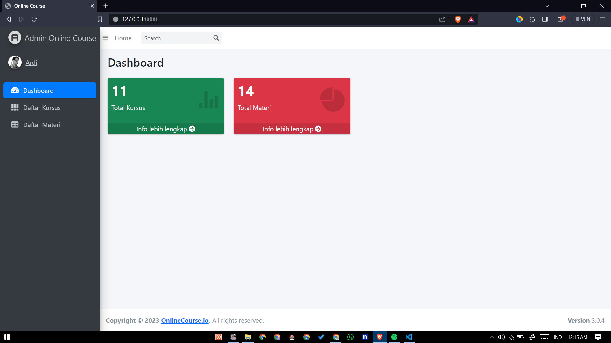
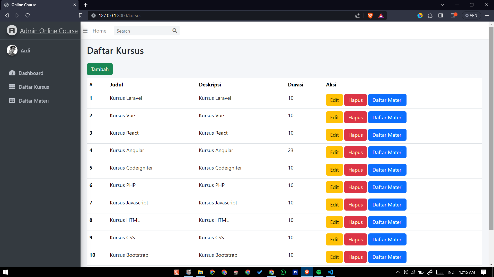
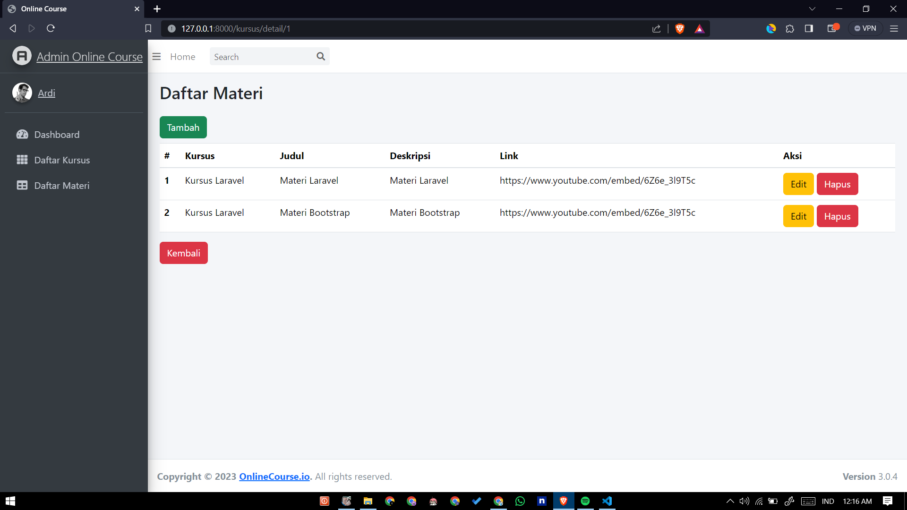
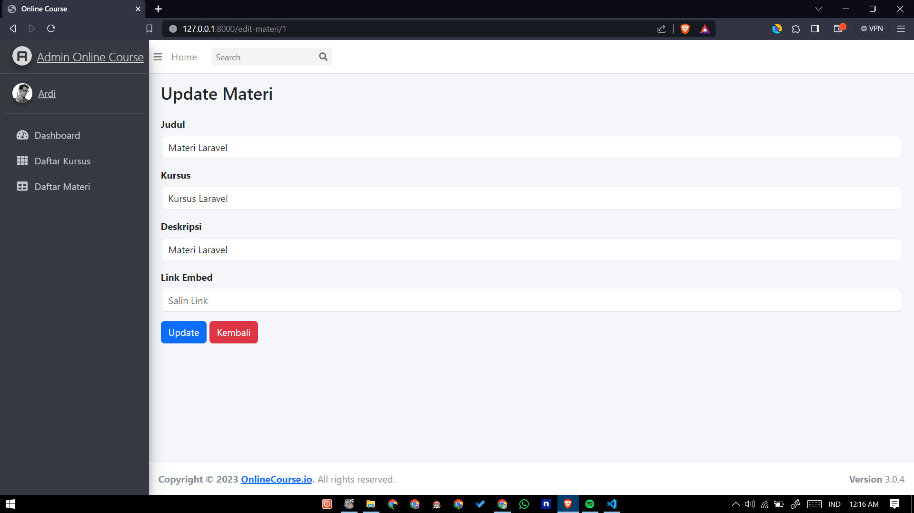

# Online Course

Aplikasi untuk Ardi seorang admin platform online course untuk mengelola kursus dan materi.

Untuk menggunakan gunakan perintah composer install

Buat database baru, sesuaikan dengan env

Jalankan php artisan migrate --seed

## Screenshots

Halaman Dashboard

Halaman Daftar Kursus

Halaman Detail Materi Kursus

Halaman Edit Kursus

Halaman Daftar Materi

Halaman Update Materi
